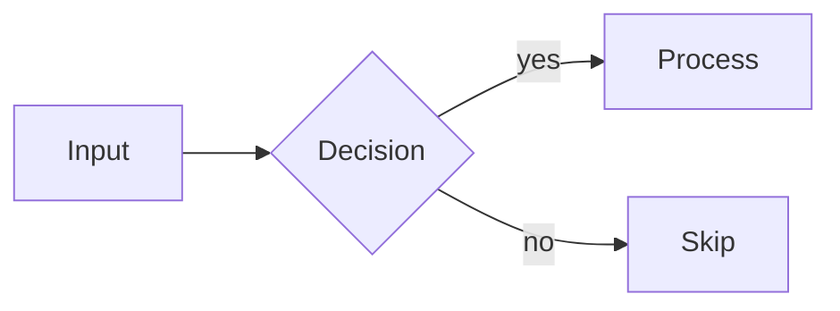
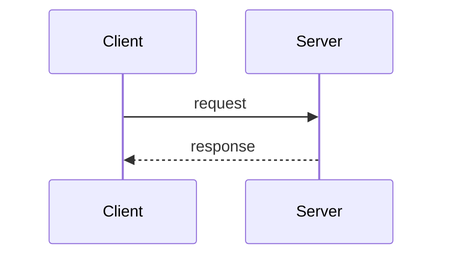
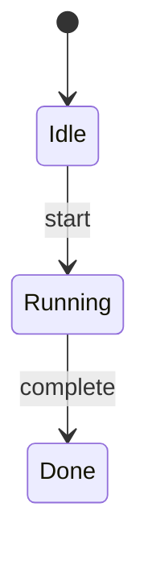

Generate Mermaid diagrams for architecture, flows, sequences, or state machines.

**When to use**: visualizing architecture, data flows, sequences, state machines, decision trees.
**Input**: a description of what to diagram, or a symbol/module to visualize.

## Supported Types

**Flowchart** — architecture, data flow, decision trees:

**Sequence** — API calls, message passing, request/response:

**State** — lifecycle, status transitions:

## Rendering

If `mcp__claude_ai_Mermaid_Chart__validate_and_render_mermaid_diagram` is available, use it to render. Otherwise, output raw Mermaid in a fenced `mermaid` code block.

## Tips

- Keep diagrams simple — under 15 nodes; use `subgraph` for grouping
- Use `"quotes"` for labels with special chars; `LR` for pipelines, `TB` for hierarchies
- Read `.opsx/arch.md` or `.opsx/modules.md` for real structure before diagramming
