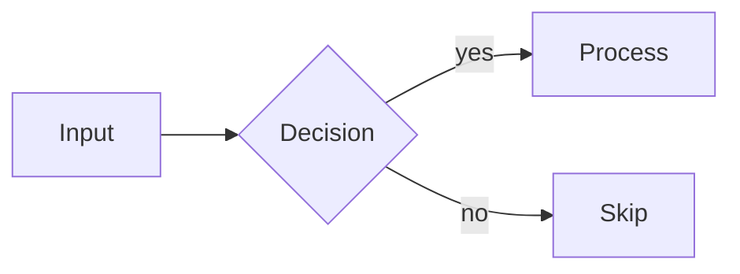
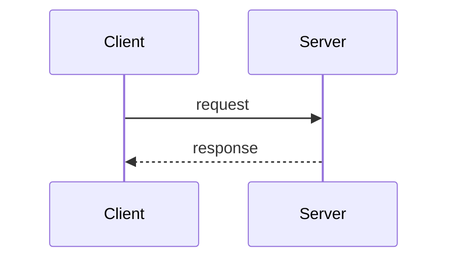
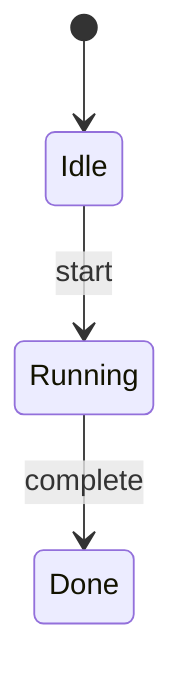

Generate Mermaid diagrams for architecture, flows, sequences, or state machines.

## Supported Types

**Flowchart** -- architecture, data flow, decision trees:

**Sequence** -- API calls, message passing:

**State** -- lifecycle, status transitions:

## Rendering

If `mcp__claude_ai_Mermaid_Chart__validate_and_render_mermaid_diagram` is available, use it. Otherwise, output raw Mermaid in a fenced block.

## Tips

- Under 15 nodes; use `subgraph` for grouping
- `"quotes"` for labels with special chars; `LR` for pipelines, `TB` for hierarchies
- Read `.opsx/arch.md` or `.opsx/modules.md` for real structure before diagramming
